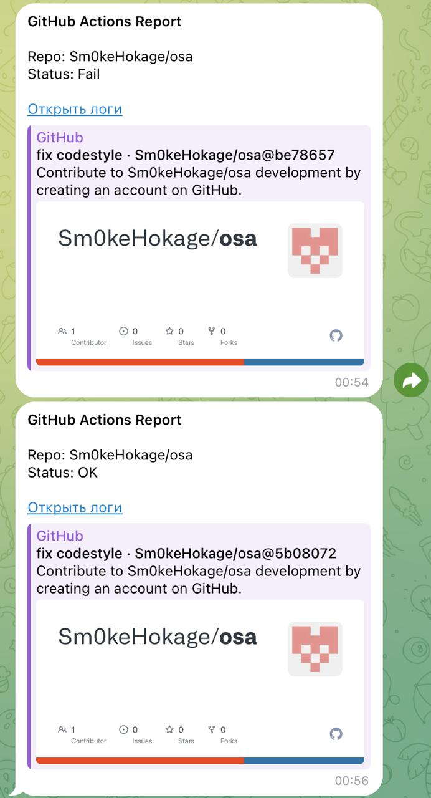

## Отчет по практическому заданию (CI/CD)

### 1. Сборка и Пайплайн
*   Создан workflow `ci-cd.yml`.
*   Реализована сборка приложения (копирование исходников в `dist`).
*   Настроена передача артефактов (`upload-artifact` / `download-artifact`) между стадиями сборки и деплоя.

### 2. Деплой
*   Реализована job-заглушка, которая эмулирует выкладку кода, скачивает артефакты и выводит список файлов.

### 3. Нотификации
*   Подключен `appleboy/telegram-action`.
*   После завершения всех стадий в Telegram приходит сообщение со статусом (Успех/Ошибка) и ссылкой на логи.

### 4. Шаблоны и расширяемость 
*   Использован `strategy: matrix` для запуска деплоя параллельно на `test` и `prod`.
*   Использован Reusable Workflow: логика деплоя вынесена в отдельный файл `deploy-job.yml` и подключается через `uses`.

### 5. Качество кода
*   В пайплайн встроен линтер `flake8`.
*   Добавлены автоматические тесты `pytest` (запускаются при каждом пуше).

### 6. Безопасность
*   Добавлена базовая проверка на наличие явных секретов (паролей) в коде через bash-скрипт в пайплайне.

### 7. Правила
*   Пайплайн срабатывает только на ветки `main` и `master`.
*   Настроен `schedule` (cron) для ночного запуска.

### 8. Релизы
*   Создан файл `release.yml`. При создании git-тега (например, `v1.0.0`) автоматически создается Release в интерфейсе GitHub и генерируется описание изменений (Release Notes).

